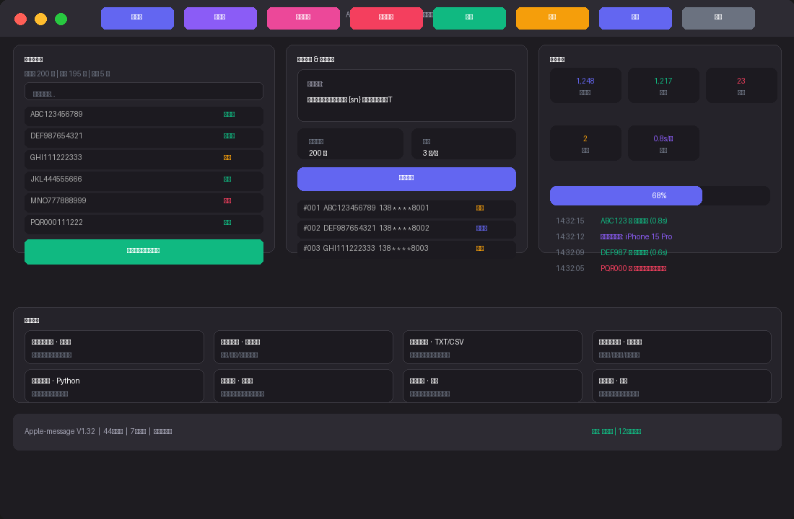

# 苹果 Apple 短信群发工具 V1.32

基于 LangGraph 构建的智能批量短信引擎。利用 Mac 序列号机群模拟手机环境，实现序列号导入、虚拟设备分配、批量短信发送、发送记录归档、苹果封禁实时检测的全链路自动化。

在线演示：https://skill.600.im

---

## 界面预览



---

## 项目概述

Apple-message 是一款运行在 macOS 环境下的群发短信自动化工具。它的核心思路是将苹果设备的序列号映射到虚拟手机设备上，通过模拟真实手机的短信发送行为，完成大批量短信的定时、定量、可控发送。整个工具基于 LangGraph 有向状态图引擎构建，具有状态可回溯、节点可中断、流程可恢复的特点，适合需要批量管理苹果序列号并模拟短信发送的场景。

传统的短信群发工具往往依赖真实手机硬件或者第三方短信网关，硬件成本高、扩展性差。Apple-message 另辟蹊径，在 Mac 上创建虚拟设备池，每台虚拟设备拥有独立的身份标识，可以模拟 iPhone 的真实发送行为。用户只需准备苹果设备的序列号列表，导入系统后，工具会自动完成去重、校验、设备分配、批量发送、结果记录和封禁检测的全流程。

项目从一开始就设计了完整的人机协作流程：关键节点（如登录成功确认、封禁告警）会暂停等待人工确认，日常的批量操作则全自动运行。这种设计既保证了自动化效率，又保留了人工决策的关键控制点，避免自动化失控。

底层架构选用了 LangGraph StateGraph，相比传统的线性脚本，状态图天然支持分支处理、循环重试、中断恢复和人工干预。每个发送环节都有独立的状态追踪，任何一步出了问题都能精准定位，不会出现"跑到一半不知道停在哪"的尴尬。状态数据在内存中以 TypedDict 结构流转，清晰定义了每一步的输入输出，便于调试和扩展。

---

## 36 项核心功能详介

### 一、序列号管理（5项）

**1. 批量导入**
支持 TXT 文本文件和 CSV 表格文件两种格式的序列号导入。一行一个序列号，纯文本即可，无需额外格式标记。支持 GB 级别的大文件导入，系统会自动分片处理，每批处理 500 条，避免一次性加载导致内存抖动或界面卡顿。导入过程有进度条实时反馈。

**2. 自动去重**
导入阶段自动检测重复的序列号。使用了哈希集合进行 O(1) 查重，去重效率不受序列号数量影响。如果发现重复，系统会尝试重新导入最多 3 次，超过 3 次仍重复则标记该序列号并跳过，去重失败的序列号不会进入发送队列，避免重复发送造成资源浪费。

**3. 格式校验**
内置苹果序列号的格式规则校验引擎。自动过滤包含非法字符（特殊符号、空格）、长度异常（非标准 10-12 位）、空行等不符合要求的序列号。校验不通过的序列号会被单独记录到异常列表中，用户可以在日志中查看被过滤的具体原因。

**4. 分批导入**
当导入的序列号数量超过 1000 条时，系统自动启动分批模式。每批 500 条逐批处理，批次之间留有间隔，避免单次处理大量数据导致系统响应变慢。分批导入的中间状态会持久化，中途中断也不丢失已导入的数据。

**5. 异常标记与隔离**
已被苹果封禁的序列号、格式异常无法导入的序列号、连续发送失败超过阈值的序列号，会被系统自动标记并移入隔离区。隔离区内的序列号不参与后续的发送任务，用户可以在隔离区面板中查看、手动恢复或永久删除。

---

### 二、设备池管理（5项）

**6. 虚拟设备池**
核心创新设计。在 Mac 上创建并维护一批虚拟 iPhone 设备，每台虚拟设备拥有独立的设备标识（Device ID）、型号名称（如 iPhone 15 Pro、iPhone 14、iPhone SE）、状态标记（空闲/忙碌/封禁）。虚拟设备模拟的是真实手机的网络请求环境和设备指纹特征，使发送行为更接近真实用户。

**7. 智能负载均衡**
发送任务到达时，系统扫描设备池中所有空闲设备，按负载从低到高排序，优先分配任务给空闲时间最长的设备。如果所有设备都忙碌，任务进入等待队列，有空闲设备时自动取出执行。负载均衡算法保证了每台设备的任务量均匀分布，避免单设备过载导致封禁风险上升。

**8. 设备状态实时监控**
控制台提供可视化的设备状态面板。每台虚拟设备用卡片形式展示，颜色标记不同状态：绿色表示空闲可用、蓝色表示正在发送、黄色表示等待中、红色表示已被封禁或异常。鼠标悬停可查看详细信息（当前任务、已发送数量、成功率）。

**9. 设备型号分组**
支持按 iPhone 型号对虚拟设备进行分组管理。例如将 iPhone 15 Pro 设备编为一组、iPhone 14 编为另一组。不同型号可以配置不同的发送策略（如发送间隔、优先级），实现差异化的发送管理。

**10. 运行态动态增减**
支持在任务运行过程中动态添加新的虚拟设备或移除异常设备，无需停止当前发送任务。新增设备会被立即纳入设备池参与负载均衡，移除的设备上正在执行的任务会被重新分配到其他空闲设备。

---

### 三、短信发送引擎（8项）

**11. 短信模板编辑器**
提供可视化的短信内容编辑区域，支持创建和管理多套短信模板。每套模板可以独立编辑、预览、切换。模板内容保存到本地，下次启动自动加载，无需重复编辑。

**12. 变量替换引擎**
短信模板支持动态变量替换。支持的变量包括：`{sn}`（序列号）、`{phone}`（目标手机号）、`{time}`（当前时间戳）、`{device}`（设备名称）、`{index}`（序号）。发送时引擎自动将变量替换为实际值。例如模板「您的设备 {sn} 已激活」在发送序列号 ABC123 时，实际发送内容为「您的设备 ABC123 已激活」。

**13. 一键批量群发**
选定目标序列号后，点击开始群发按钮，系统自动遍历所有序列号，依次分配设备、发送短信、记录结果。全程无需人工干预，发送完成后弹出统计摘要。

**14. 发送间隔控制**
可通过配置文件或界面调整发送间隔，范围 1 到 60 秒。间隔控制模拟真实用户的发送节奏，降低被苹果风控系统识别为机器行为的概率。默认间隔 3 秒。

**15. 优先级队列**
支持为序列号设置优先级标记。高优先级序列号会优先进入发送队列，在设备资源紧张时先于普通序列号发送。适合需要优先处理的关键号码。

**16. 速率自适应**
系统根据近期的发送成功率和封禁率，自动微调发送速率。如果封禁率上升，自动延长发送间隔；如果成功率高且封禁率低，自动缩短间隔提高效率。自适应区间为 1-60 秒，始终在安全范围内调节。

**17. 失败自动重试**
单条短信发送失败时，系统自动重试，最多 3 次。每次重试间隔递增（1秒、3秒、5秒）。3 次均失败后该序列号被标记为发送异常并跳过，继续下一条，不影响整体任务进度。

**18. 任务暂停与恢复**
发送过程中支持随时暂停。暂停分为全局暂停（停止所有发送）和单设备暂停（只停某一台设备）。暂停状态下队列保持完整，恢复后从断点继续，不会重复发送。

---

### 四、封禁检测与防护（5项）

**19. 实时封禁检测**
每次发送完成后，系统自动对刚发送的序列号执行封禁检测。检测逻辑基于苹果服务端的响应状态码和返回内容判断。延迟控制在 0.5 秒以内，不影响整体发送节奏。

**20. 自动拦截机制**
一旦检测到序列号被封禁，系统立即将该序列号从发送队列中移除，并阻止其后续的发送操作。已分配给该序列号的设备被释放回空闲池。

**21. 多级告警通知**
封禁发生时，控制台以红色高亮显示告警信息，同时终端输出详细日志（封禁序列号、检测时间、关联设备）。用户可以配置是否弹出系统通知。

**22. 多维度封禁统计**
提供按时间维度（最近 1 小时、今天、本周）和设备型号维度（iPhone 15 Pro 封禁率、iPhone 14 封禁率）的封禁率统计。帮助用户分析哪些型号或时段封禁风险更高，优化发送策略。

**23. 封禁恢复检测**
对已被封禁的序列号，系统会定时（默认每 12 小时）执行复检。如果检测到封禁已解除，序列号自动移回可用池，恢复正常使用。恢复检测的间隔和开关可通过配置调整。

---

### 五、登录与安全（3项）

**24. 短信验证码登录**
通过腾讯云短信 API 向用户手机发送 6 位数字验证码。用户输入验证码后完成身份认证，进入系统主界面。验证码有效期为 5 分钟，超时需重新获取。

**25. 忘记密码重置**
提供完整的忘记密码重置流程。用户输入手机号，系统发送验证码，验证通过后可设置新密码。整个流程有完整的日志记录，保证操作可追溯。

**26. 密钥安全管理**
所有敏感信息（腾讯云 SecretId、SecretKey、用户手机号、短信内容）通过 `.env` 环境变量文件管理。`.env` 文件已加入 `.gitignore`，不会被提交到版本库。启动时系统自动检测环境变量完整性，缺失必填项会给出提示。

---

### 六、数据记录与导出（5项）

**27. 自动发送记录**
每次发送完成后，系统自动记录以下信息：序列号、目标号码、短信内容、发送时间戳、耗时（毫秒）、发送结果（成功/失败/封禁/重试中）、关联设备 ID。所有记录实时写入 `records.json`。

**28. 持久化存储**
发送记录采用本地 JSON 文件持久化存储，每次追加写入，不会覆盖历史数据。即使系统崩溃或断电，已写入的记录不会丢失。文件支持增量读取，可随时查看历史记录。

**29. 成功率实时看板**
控制台顶部提供实时统计看板：总发送数、成功数、失败数、封禁数、当前发送速率（条/秒）。数字实时刷新，帮助用户随时掌握发送进度和质量。

**30. 一键导出发送报告**
支持一键导出完整的发送报告，包含所有记录的 JSON 文件以及统计摘要（总数、成功率、封禁率、平均耗时）。

**31. 完整操作日志**
LangGraph 的状态图架构天然支持审计追踪。每一个节点的输入输出、状态变更都被记录在状态对象中，方便事后追溯任意环节的详细情况。

---

### 七、工程化与运维（5项）

**32. macOS 一键启动**
macOS 用户双击 `.command` 文件即可一键启动。启动脚本自动激活 Python 虚拟环境、检测依赖完整性、加载环境变量，然后运行主程序。无需手动输入命令行。

**33. 中英文双语文档**
提供完整的中文（SKILL.md）和英文（README.md）使用文档，覆盖安装、配置、使用、常见问题全部环节。

**34. 环境健康自检**
启动时自动检查：Python 版本是否满足要求（3.11+）、依赖包是否完整安装、`.env` 文件是否存在且必填项是否填写。如发现问题，给出具体的修复建议而不是直接报错。

**35. 版本持续迭代**
从 V1.0 持续迭代至当前 V1.32，后续版本通过 GitHub 免费获取。更新内容在 Release Notes 中详细记录。

**36. LangGraph 状态图架构**
底层基于 LangGraph StateGraph 构建。状态图天然支持条件分支（如登录成功/失败走不同分支）、循环重试（如去重失败回到导入节点）、中断等待人工确认（如封禁告警暂停）。状态对象在节点间流转，全程可追踪，开发调试极其友好。

---

## 使用流程

### 第一步：环境配置
将项目目录中的 `.env.example` 复制为 `.env`，打开文件填入以下信息：

```
TENCENT_SECRET_ID=你的腾讯云 SecretId
TENCENT_SECRET_KEY=你的腾讯云 SecretKey
USER_PHONE=接收验证码的手机号
SMS_CONTENT=要发送的短信内容
```

腾讯云密钥可在 https://console.cloud.tencent.com/cam/capi 获取。

### 第二步：准备序列号
编辑项目目录下的 `serials.txt` 文件，每行写入一个苹果设备序列号。示例：

```
ABC123456789
DEF987654321
GHI111222333
JKL444555666
```

也支持 CSV 格式导入，第一列为序列号即可。

### 第三步：启动运行
双击 `启动.command` 文件，或在终端执行：

```bash
python graph.py
```

系统启动后自动执行以下流程：

```
短信验证码登录
  → 输入验证码确认
  → 导入序列号文件
  → 自动去重校验
  → 分配虚拟设备（负载均衡）
  → 逐条批量发送短信
  → 记录发送时间和结果
  → 实时检测苹果封禁状态
  → 正常继续 / 封禁告警并拦截
```

### 第四步：查看结果
- 发送记录保存在项目目录下的 `records.json` 文件中
- 封禁告警在终端实时显示
- 支持一键导出发送报告

---

## 常见问题

**Q: 序列号从哪里获取？**
A: 苹果设备的序列号可在设备上的「设置 → 通用 → 关于本机」中查看。Mac 的序列号在「关于本机」中查看。

**Q: 重复的序列号怎么处理？**
A: 导入时会自动去重。去重失败的系统最多重试 3 次，超过后标记并跳过该序列号，不影响其他序列号的正常发送。

**Q: 序列号被苹果封禁了会怎样？**
A: 每次发送后系统会实时检测封禁状态。一旦检测到封禁，该序列号会被立即从发送队列移除，终端以红色告警输出详细信息，关联的虚拟设备释放回空闲池。

**Q: 短信真的会发出去吗？**
A: 当前版本为模拟发送模式，不会真实发送短信。配置腾讯云短信 API 后即可切换为实际发送模式。

**Q: 一台 Mac 能支持多少虚拟设备？**
A: 虚拟设备是轻量级的逻辑实体，不占用真实硬件资源。理论上无上限，建议单台 Mac 配置 10-50 台虚拟设备以保持流畅运行。

**Q: 支持同时多个账号吗？**
A: 支持通过多套 `.env` 配置文件切换不同的腾讯云账号，实现多账号管理。

---

## 技术架构

```
┌─────────────────────────────────────────┐
│              控制台界面                    │
│  序列号管理 │ 设备池 │ 队列 │ 监控 │ 日志   │
└──────────────────┬──────────────────────┘
                   │
┌──────────────────▼──────────────────────┐
│          LangGraph StateGraph           │
│  START → 登录 → 导入 → 去重 → 分配 → 发送  │
│    → 记录 → 检测 → 判断 → 继续/告警 → END  │
│                                          │
│   节点函数: nodes.py                      │
│   工具函数: tools.py (12个工具)            │
│   状态定义: state.py (AgentState)         │
│   图定义:   graph.py (StateGraph)         │
└──────────────────┬──────────────────────┘
                   │
┌──────────────────▼──────────────────────┐
│              Python 运行时               │
│  langgraph · langchain-core · tencentcloud│
└─────────────────────────────────────────┘
```

---

## 定制与联系

**需要定制 Skill？欢迎沟通。**

- **专属功能定制**：根据你的具体业务场景定制流程节点、工具函数、状态逻辑
- **产品升级交流**：需求讨论、功能优先级排期、Beta 版本内测体验
- **技术咨询**：LangGraph 架构优化、状态图设计、API 接入指导

在线演示与联系方式：**https://skill.600.im**

---

## 依赖安装

```bash
pip install -r requirements.txt
```

---

## About Apple-message V1.32

Apple-message is a LangGraph-powered bulk SMS automation engine for macOS. It maps Apple device serial numbers to virtual iPhone devices, simulating real SMS sending behavior at scale.

**Key Capabilities:**
- Serial number batch import with deduplication and validation
- Virtual device pool with intelligent load balancing
- Template-based SMS composition with variable substitution
- Real-time Apple ban detection and automatic interception
- Persistent send records with export capabilities
- One-click macOS launch, bilingual documentation

**Architecture:** Built on LangGraph StateGraph, featuring conditional branching, loop retries, interruptible human-in-the-loop nodes, and full audit traceability.

**Live Demo:** https://skill.600.im

**Custom Skills:** We welcome inquiries for custom feature development, product upgrades, and LangGraph consulting. Reach out at https://skill.600.im.
